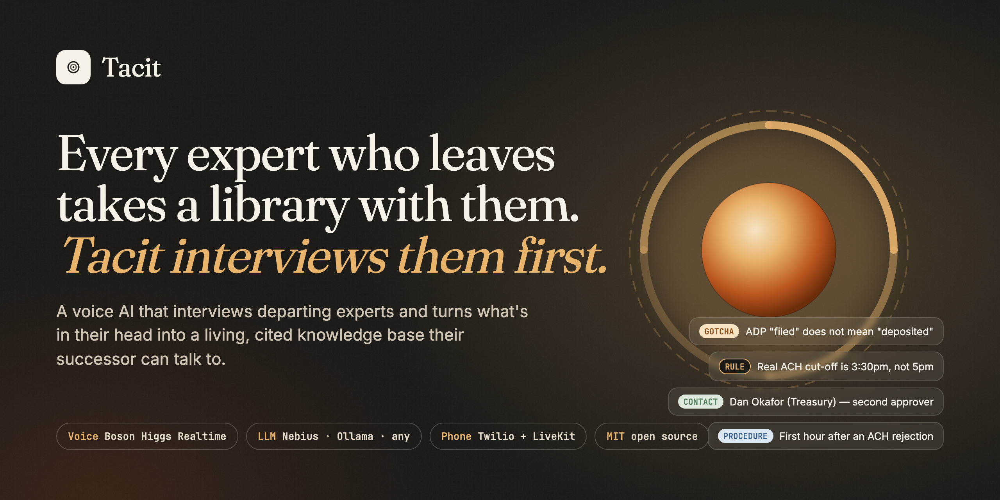
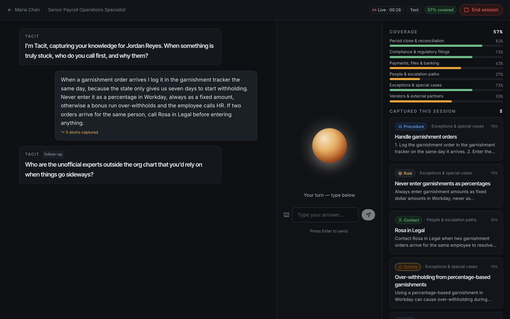
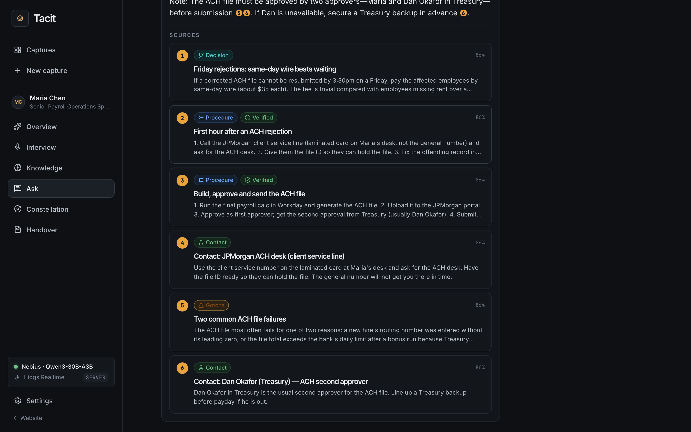
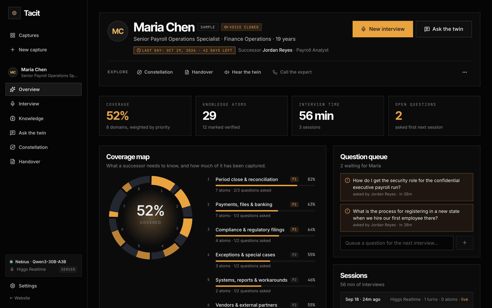
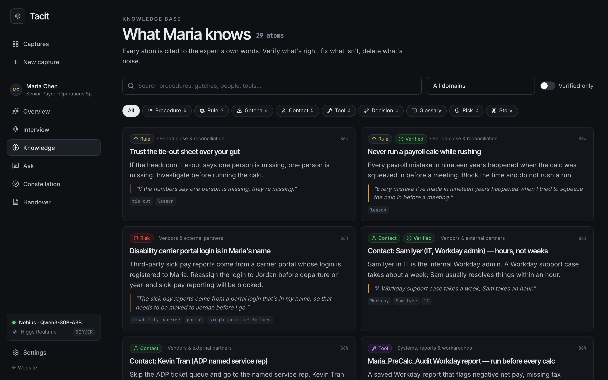
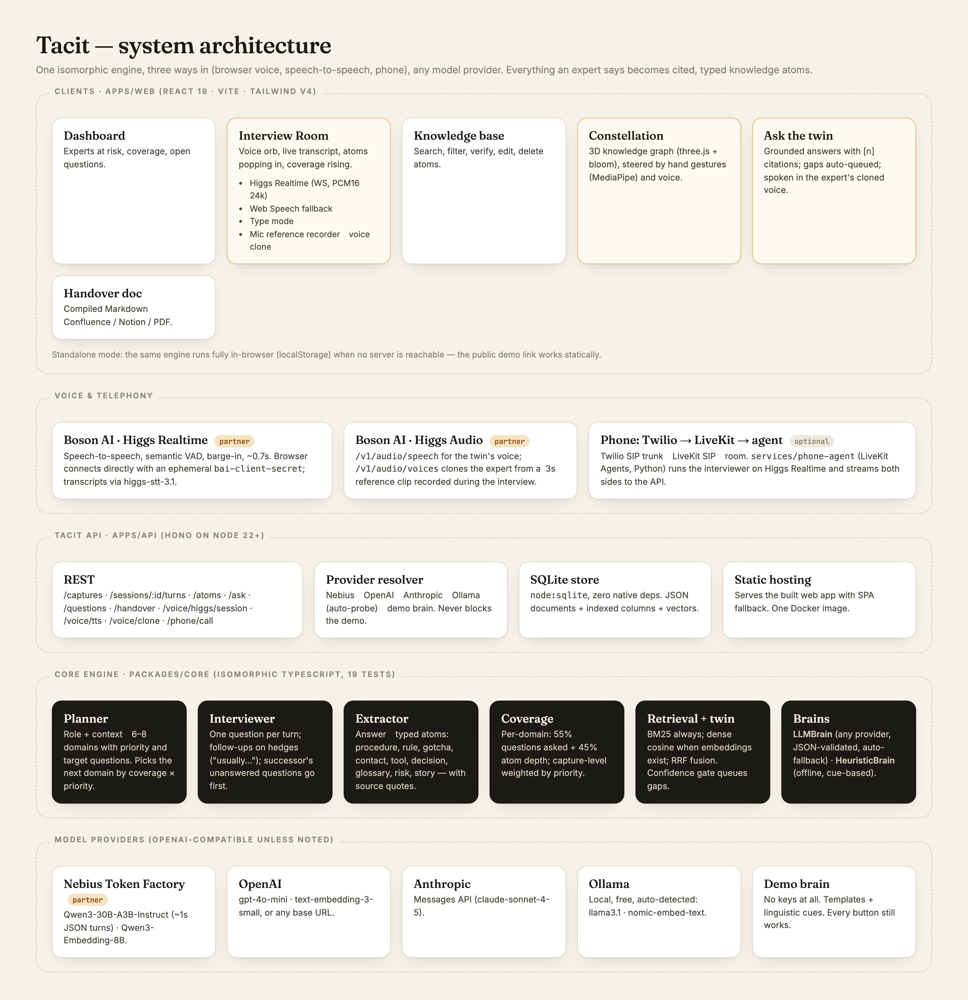
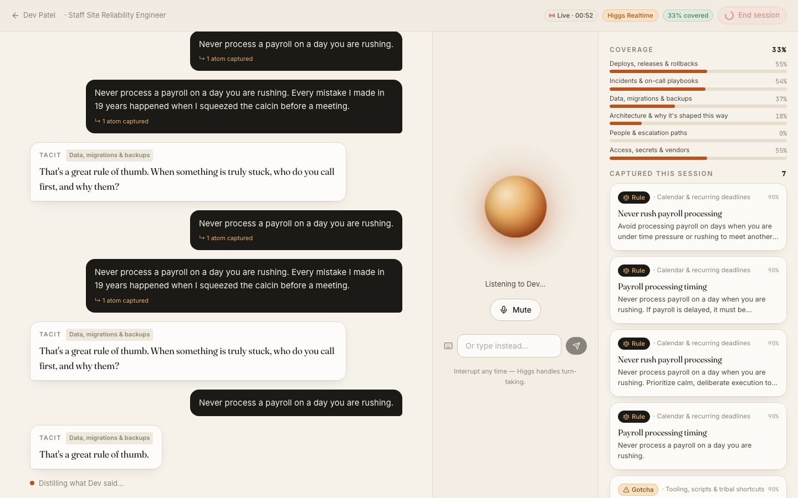

<p align="center">
  
</p>

<h1 align="center">Tacit</h1>

<p align="center">
  <strong>A voice AI that interviews your departing experts and turns what's in their head into a living, cited knowledge base their successor can talk to.</strong>
</p>

<p align="center">
  <a href="https://vnmoorthy.github.io/tacit/"></a>
  <a href="https://github.com/vnmoorthy/tacit/actions/workflows/ci.yml"></a>
  
  
  <a href="LICENSE"></a>
  
</p>

<p align="center">
  <a href="https://vnmoorthy.github.io/tacit/">Live demo</a> ·
  <a href="#quickstart">Quickstart</a> ·
  <a href="#how-it-works">How it works</a> ·
  <a href="docs/ARCHITECTURE.md">Architecture</a> ·
  <a href="docs/API.md">API</a> ·
  <a href="docs/PHONE.md">Phone interviews</a> ·
  <a href="docs/DEMO.md">3-minute demo script</a> ·
  <a href="slides/Tacit.pptx">Slides</a>
</p>

---

## The problem

Every day about **10,000 Americans turn 65**.¹ When a 19-year payroll lead, a staff SRE or a plant technician walks out, the runbook they never wrote goes with them: the real cut-off time (3:30, not 5), the vendor rep who actually answers, the macro on their desktop, the rule that exists because of an incident nobody remembers.

Companies know this. Fortune 500s lose an estimated **$31.5B a year** from failing to share knowledge,² and **42% of the skills needed for a job are known only by the person currently doing it**.³ The fix has always been "write the documentation". Experts don't. But they will *talk* for an hour.

**Tacit makes the talking the documentation.**

<sub>¹ Pew Research Center · ² IDC, via Babcock (2004) · ³ Panopto Workplace Knowledge and Productivity Report (2018)</sub>

## What Tacit does

<table>
<tr>
<td width="50%"></td>
<td width="50%"></td>
</tr>
<tr>
<td><b>1 · Interview.</b> A voice agent interviews the expert one question at a time, follows the thread ("you said <i>usually</i> — when isn't that the case?"), and probes for failure modes, cut-offs and who-to-call. Knowledge atoms appear as they speak; the coverage map fills in live.</td>
<td><b>2 · Hand over.</b> The successor asks the expert's <i>twin</i>. Answers come only from what the expert said, with citations back to their own words, spoken in their cloned voice. If the twin doesn't know, the question is queued and becomes the <b>first question of the next interview</b>.</td>
</tr>
<tr>
<td></td>
<td></td>
</tr>
<tr>
<td><b>3 · Measure.</b> Tacit plans a coverage map of 6–8 knowledge domains from the role and context, weighted by priority, and shows exactly what a successor still can't do.</td>
<td><b>4 · Curate & compile.</b> Nine atom types (procedure, rule, gotcha, contact, tool, decision, glossary, risk, story) with source quotes. Verify, edit, search. One click compiles a handover document.</td>
</tr>
</table>

### Features

- **Real-time voice interviews** on Boson AI's **Higgs Realtime** (speech-to-speech, semantic turn detection, barge-in), with a zero-key **browser voice** fallback and a **type** mode. The demo can't die on stage.
- **Live extraction** of typed, cited knowledge atoms while the expert is still talking.
- **Coverage map**: planned domains × target questions; the interviewer steers to what's missing.
- **The successor twin**: hybrid retrieval (BM25 + embeddings, RRF-fused), grounded answers with `[n]` citations, confidence gating.
- **The closed loop**: unanswered successor questions are queued and asked first next session.
- **Voice cloning**: with the expert's consent, Higgs Audio clones their voice from the interview so the twin speaks like them.
- **Phone interviews**: Tacit calls the expert (Twilio SIP → LiveKit → Higgs Realtime agent). See [docs/PHONE.md](docs/PHONE.md).
- **Handover document** compiled from everything captured (Markdown → Confluence/Notion/PDF).
- **Runs anywhere**: any OpenAI-compatible LLM (Nebius first-class), Anthropic, local Ollama, or an offline demo brain. The same engine runs fully in the browser, so the [live demo](https://vnmoorthy.github.io/tacit/) works with no backend at all.
- **Zero native dependencies**: Node's built-in SQLite, one Docker image, 14 tests.

## Quickstart

```bash
git clone https://github.com/vnmoorthy/tacit.git && cd tacit
pnpm install
pnpm dev          # API on http://localhost:8787, web on http://localhost:5173
```

That's it. With no keys Tacit runs the offline demo brain and your browser's speech APIs. Click **Load sample captures** on the dashboard to meet Maria (payroll) and Dev (SRE).

To make it *good*, add keys to a `.env` at the repo root (see [`.env.example`](.env.example)):

```bash
NEBIUS_API_KEY=...     # interviewer + extraction on Nebius Token Factory (or OPENAI_API_KEY / ANTHROPIC_API_KEY)
BOSON_API_KEY=...      # Higgs Realtime voice, Higgs Audio TTS + voice cloning
```

If [Ollama](https://ollama.com) is running locally it's auto-detected (`llama3.1:8b` + `nomic-embed-text`), no key needed.

```bash
pnpm seed         # load sample captures into SQLite
pnpm test         # 14 tests across core + api
pnpm build        # production web build (served by the API)
```

## How it works

<p align="center"></p>

### The engine (`packages/core`)

One isomorphic TypeScript engine runs on the server (SQLite) and in the browser (localStorage). Everything is a pure function of a `Store` and a `Brain`.

| Stage | What it does |
|---|---|
| **Planner** | Role + context → 6–8 domains, each with a priority (1–3) and 2–3 open target questions. Next domain = lowest coverage adjusted by priority. |
| **Interviewer** | One question per turn. Follows up on hedges ("usually", "depends", "the trick is"), asks the successor's queued questions first, moves on when a thread is exhausted, keeps every turn under 45 words so it reads aloud well. |
| **Extractor** | Expert answer → 1–6 typed atoms with title, markdown content, tags, confidence, domain and a verbatim `sourceQuote`. Runs **in parallel** with next-question planning (≈3.5 s per turn on Nebius). |
| **Coverage** | Per domain: 55 % × questions asked + 45 % × min(1, atoms/5). Capture-level: weighted by priority (3/2/1). |
| **Twin** | BM25 over title+content+tags+quote, plus dense cosine when embeddings exist, fused with reciprocal-rank fusion. The brain answers only from the top atoms and reports confidence; `low`/`none` queues the question. |
| **Handover** | Compiles atoms by domain and type, verified marks, quotes, open questions, session log. |

Two interchangeable brains implement the same interface:

- **`LLMBrain`** — any model via `OpenAICompatibleLLM` (Nebius, OpenAI, Groq, Ollama, gateways) or `AnthropicLLM`. JSON is validated; on any failure it silently falls back to…
- **`HeuristicBrain`** — no model at all. Role templates plan the map; linguistic cues (first/then/never/call/careful/…) classify sentences into atoms; retrieval is extractive. Every button works offline.

### The voice stack (`apps/web/src/lib/voice`)

<p align="center"><br/><sub>A live Higgs Realtime session captured in an automated browser run with a synthetic microphone: expert audio → transcript → atoms → refreshed agenda → next spoken question.</sub></p>

| Engine | Path | When |
|---|---|---|
| **Higgs Realtime** | Browser ⇄ `wss://api.boson.ai/v1/realtime` (ephemeral `bai-client-secret`, PCM16 @ 24 kHz, OpenAI Realtime events). User transcripts via `higgs-stt-3.1` → `/sessions/:id/turns` for extraction; the agenda is refreshed with `session.update` after every answer. | `BOSON_API_KEY` set |
| **Browser voice** | Web Speech recognition (1.6 s end-of-turn) → API → `speechSynthesis`. | Always available in Chrome/Edge/Safari |
| **Higgs Audio** | `/v1/audio/speech` for the twin's spoken answers; `/v1/audio/voices` clones the expert from a reference clip recorded during a browser-voice session. | `BOSON_API_KEY` set |
| **Phone** | Twilio SIP trunk → LiveKit room → `services/phone-agent` (LiveKit Agents) on Higgs Realtime → Tacit API. | LiveKit + Twilio configured |

### Atom types

| Type | Meaning | Example from Maria |
|---|---|---|
| `procedure` | Ordered steps | First hour after an ACH rejection |
| `rule` | Always / never / if-then | Real ACH cut-off is 3:30 pm, not 5 |
| `gotcha` | Trap or quirk | ADP "filed" does not mean "deposited" |
| `contact` | Who to call, and for what | Kevin Tran, ADP named rep (skip the queue) |
| `tool` | System, report, script, spreadsheet | `RECON_v7` macro that lives only on her desktop |
| `decision` | Judgement call and the factors weighed | Friday rejections: same-day wire beats waiting |
| `glossary` | Term or acronym | — |
| `risk` | What can go wrong, trigger, impact | Disability-carrier portal login is in Maria's name |
| `story` | Anecdote worth keeping | — |

## Repository layout

```
tacit/
├─ packages/core/        engine: types, brains, retrieval, coverage, handover, samples, tests
├─ apps/api/             Hono + node:sqlite REST API, provider auto-detection, Boson + LiveKit glue
├─ apps/web/             Vite + React 19 + Tailwind v4, two voice engines, standalone mode
├─ services/phone-agent/ LiveKit Agents worker (Python) for phone interviews
├─ docs/                 ARCHITECTURE · API · PHONE · DEMO · assets
├─ slides/               Tacit.pptx (10 slides) + storyboard
├─ Dockerfile · docker-compose.yml · .github/workflows (CI, GitHub Pages)
```

## API

All endpoints are JSON under `/api`. Full reference in [docs/API.md](docs/API.md).

| Method | Path | Purpose |
|---|---|---|
| `POST` | `/captures` | Plan a capture (coverage map) for an expert |
| `POST` | `/captures/:id/sessions` | Start an interview; returns the opening question |
| `POST` | `/sessions/:id/turns` | Expert said something → atoms + next question |
| `POST` | `/captures/:id/ask` | Ask the twin → grounded answer with citations |
| `GET`  | `/captures/:id/handover` | Compiled handover Markdown |
| `POST` | `/voice/higgs/session` | Ephemeral Higgs Realtime credentials + interviewer instructions |
| `POST` | `/voice/tts` · `/captures/:id/voice/clone` | Higgs Audio speech · clone the expert's voice |
| `POST` | `/phone/call` | Dispatch the phone interviewer and dial the expert |

## Deploy

- **Docker**: `docker compose up` → http://localhost:8787 (API + web, SQLite on a volume).
- **Any Node host** (AWS App Runner / ECS / Fly / Render): `pnpm install && pnpm build && pnpm start`, set `API_PORT` or `PORT`, mount `data/`.
- **Static demo** (no backend): `VITE_BASE=/tacit/ pnpm --filter @tacit/web build` → deploy `apps/web/dist` anywhere. The GitHub Pages workflow does this on every push to `main`.

## Roadmap

- [ ] Inbound phone line ("call Tacit when you have a minute") and scheduled call-backs
- [ ] Multi-expert captures and team knowledge graphs across captures
- [ ] Confluence / Notion / SharePoint export and Slack twin
- [ ] SSO, roles, audit log, retention policies
- [ ] Evaluation harness for extraction quality across models

## Built at

**Build an AI Startup in One Day**, an [Open Source for AI](https://luma.com/oss4ai) hackathon in San Francisco — Voice AI track. Partner technology used: **Boson AI** (Higgs Realtime, Higgs Audio), **Nebius** Token Factory (inference + embeddings), with LiveKit + Twilio for telephony. Slides in [`slides/`](slides/), demo script in [docs/DEMO.md](docs/DEMO.md).

## Contributing

See [CONTRIBUTING.md](CONTRIBUTING.md). Issues and PRs welcome, especially new role templates and provider adapters.

## License

[MIT](LICENSE)
